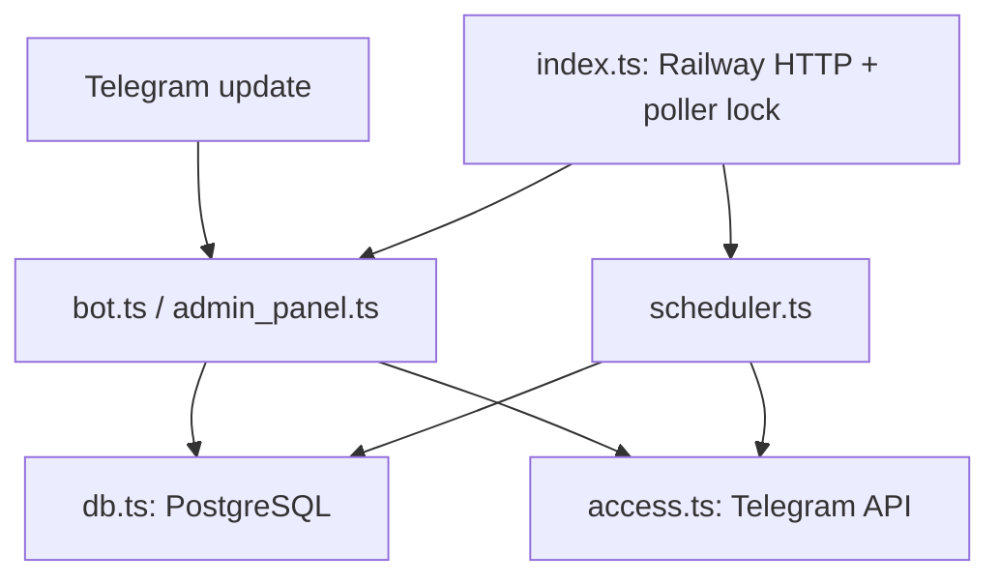
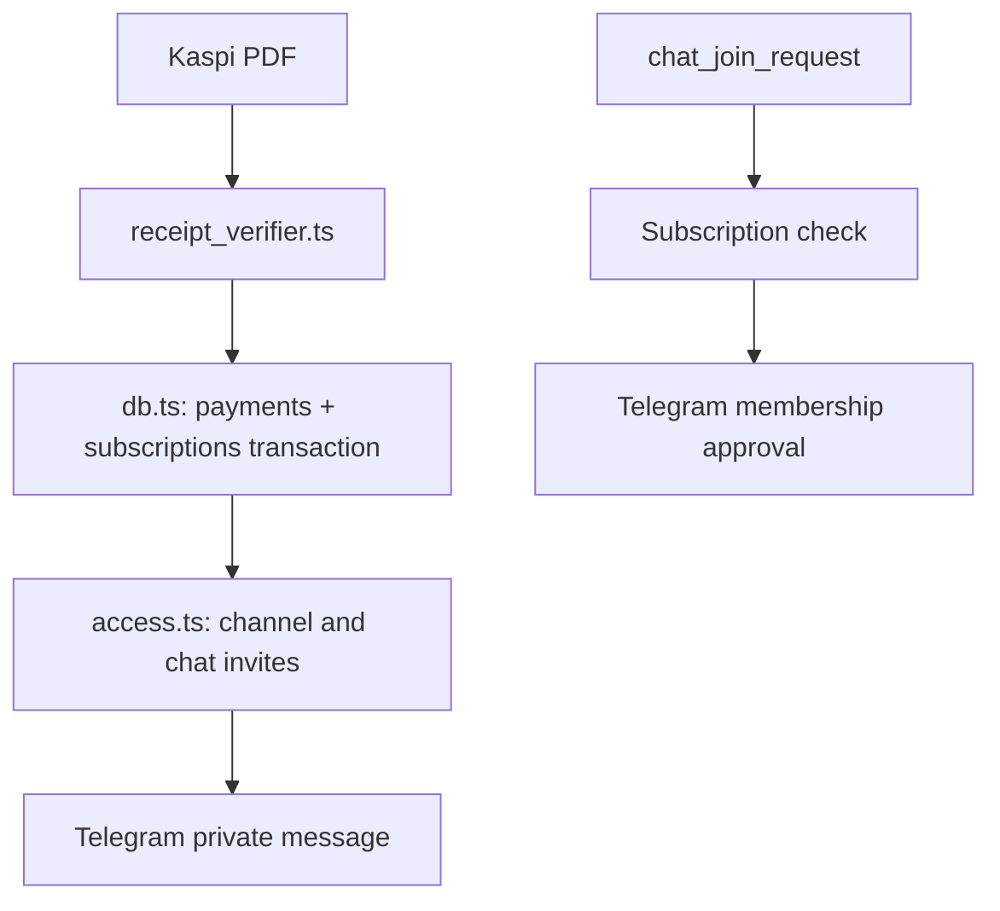

# Bakieva Chat: production review of `railway-stable`

Base commit: `27f537a` (2026-09-23). This document describes the code at that commit and the changes proposed in `audit/full-production-review`. Railway production was inspected read-only on 2026-09-24. No live PostgreSQL queries or real payment were performed.

## Architecture before changes

| Component | Tables / settings | Side effects and boundary |
|---|---|---|
| `src/bot.ts` | `users`, `payments`, `subscriptions`, language, trial settings | Telegram handlers; receipt verification before database approval; Telegram message after commit. |
| `src/receipt_verifier.ts` | None | Reads up to five PDF pages; fetches official receipt page over HTTPS. |
| `src/db.ts` | `users`, `consents`, `payments`, `subscriptions`, `settings`, `content_posts`, `trial_video_assets`, `trial_pdf_assets`, `legacy_members`, `current_chat_members`, AI chef and Instagram tables; new `access_deliveries` | `approvePaymentByVerifiedReceipt` and `approvePayment` each commit payment, subscription and pending access together. `migrate` serializes migrations with an advisory lock. |
| `src/access.ts` | `paid_channel_id`, new `paid_main_chat_id`, `talk_chat_id`, `ai_chef_chat_id`; `access_deliveries` | Per-user advisory lock serializes Telegram invites and delivery. Saves channel link before attempting main chat. Telegram API is outside payment transaction. |
| `src/admin_panel.ts` | Price, targets, trial parts and content settings | Explicit `/bind_main_chat`, diagnostic callback, retry commands. Existing legacy `paid_chat_id` paths remain for old administration, not for new paid access. |
| `src/scheduler.ts` | `subscriptions`, `legacy_members`, `access_deliveries`, report/reminder settings | Started only after poller advisory lock; retries pending transient access at most five scheduled attempts. |
| `src/index.ts` | Migration files and startup settings | Railway HTTP `/healthz`, `/readyz`; singleton poller advisory lock; graceful stop. Existing secure trial upload endpoint remains; destructive cleanup endpoint is removed. |
| `src/instagram_*`, `src/ai_chef*` | Corresponding Instagram and AI tables | Existing Instagram/webhook and Bolталка handlers were reviewed for routing; their working flows were not altered. |

**Production environment observed:** Railway project `Bakieva-Chat`, environment `production`, running service `Bakieva-Chat-App`, source `vrempel90-dev/Bakieva-Chat` branch `railway-stable`, one configured replica, `/healthz` healthcheck, build `npm install && npm run build`, start `npm start`. Its variable names include `PAID_CHANNEL_ID` and `PAID_CHAT_ID`, but not `PAID_MAIN_CHAT_ID` or `TALK_CHAT_ID`. OAuth access withheld all variable values, so actual chat IDs and production DB settings cannot be verified. Two unrelated Railway configuration changes were already staged when the review began; they were not applied.

**Environment variables read by code:** required `BOT_TOKEN`, `DATABASE_URL`, `ADMIN_IDS`, `PAID_CHANNEL_ID`, `PAID_CHAT_ID`, `KASPI_MERCHANT_BIN`, `OFFER_URL`, `PRIVACY_URL`, `DATA_CONSENT_URL`, `SUBSCRIPTION_TERMS_URL`; optional `PAID_MAIN_CHAT_ID`, `TALK_CHAT_ID`, `KASPI_PAY_URL`, `KASPI_RECEIPT_MAX_AGE_MINUTES`, `OPENAI_API_KEY`, `OPENAI_MODEL`, `META_APP_ID`, `META_APP_SECRET`, `META_WEBHOOK_VERIFY_TOKEN`, `INSTAGRAM_ACCESS_TOKEN`, `INSTAGRAM_IG_USER_ID`, `META_GRAPH_VERSION`, `PUBLIC_BASE_URL`, `RAILWAY_PUBLIC_DOMAIN`, `SUPPORT_PHONE`, `SUBSCRIPTION_PRICE`, `SUBSCRIPTION_DAYS`, `FREE_CHANNEL_URL`, `TRIAL_LESSON_URL`, `ADMIN_REPORT_HOUR`, `ADMIN_TIMEZONE`, `PORT`, `TRIAL_VIDEO_SEED_RU_URL`, `TRIAL_VIDEO_SEED_KK_URL`, `TRIAL_PDF_SEED_RU_URL`, `TRIAL_PDF_SEED_KK_URL`, `TRIAL_UPLOAD_SECRET`. The old Railway `IMPORT_TRIAL_VIDEOS_ON_START`, `PURGE_ADMIN_VIDEOS_ON_START`, `TRIAL_IMPORT_*` and `TRIAL_VIDEO_REPLACE_*` flags are no longer executed by startup code.

## Verified defects and fixes

| Severity | Category, root cause | Production impact | Fix / test |
|---|---|---|---|
| P0 | Receipt trust: `receipt_verifier.ts` accepted editable PDF text when the official Kaspi page was unavailable. | A forged PDF matching amount and BIN could activate a subscription. | Require a successful official HTTPS fetch and compare fields from its response; `receipt_security.test.ts`. |
| P0 | Chat routing: `access.ts` used legacy `paid_chat_id` as new paid chat, although the same ID was also used by legacy content and AI-adjacent administration. | A payment could produce a link for the wrong group. | Require separately bound `paid_main_chat_id`; reject known `talk_chat_id` and `ai_chef_chat_id`; access test verifies only channel and explicit main chat are used. |
| P0 | Delivery recovery: after a committed approval, a crash before `sendAccess` had no durable retry work item. | Payment active, access never sent. | New `access_deliveries` inserted in the same payment transaction; retry only access with bounded attempts. |
| P1 | Invite handling: fresh invite links were created on every attempt, with no persisted partial state. | Duplicate links, partial delivery misreported. | Per-user advisory lock, stored links and expiry, membership check, explicit partial status; `access.test.ts`. |
| P1 | Concurrent pending payment creation: read then insert could race against the unique pending index. | Spurious unique-key errors on double taps. | User-row lock for payment session, conflict-safe pending creation. |
| P1 | Railway readiness: `/healthz` always responded 200 before the poller obtained its singleton lock. | Railway could count a waiting instance as healthy. | `/readyz` now requires DB, acquired lock, started bot, scheduler and both paid target IDs; Railway healthcheck must be switched to `/readyz` only once main chat ID is bound. |
| P1 | Membership updates: polling used the Telegram default `allowed_updates`, which excludes `chat_member`. | Tracking joins and leaves by `chat_member` could silently stop. | Explicitly request `chat_member` and `chat_join_request` along with handled update types in `index.ts`. |
| P1 | Scheduler: overlapping interval runs and unhandled rejected promises. | Duplicate or aborted maintenance jobs. | In-process run guard, caught scheduler failures, stop hook, access retry queue. |
| P1 | Temporary cleanup endpoint and startup flag in `index.ts` could delete content posts, video assets and settings. | Destructive deletion of production content. | Removed endpoint and startup purge/import mechanisms; existing data was not deleted. |
| P2 | Trial parts were saved as independent settings and read as independent queries. | A user could observe old part 1 and new part 2 across a commit. | `publishTrialVideoPair` transaction and one-query `getTrialVideoPair`; existing videos are not transcoded. |
| P2 | Config included an unconditional hardcoded administrator ID; merchant BIN was optional. | Unintended admin access or receipt verification unavailable until runtime. | Admins come only from `ADMIN_IDS`, merchant BIN required at startup. |
| P2 | CI lacked a lockfile and build step. | Dependency drift and undetected build failure. | Added lockfile; CI runs `npm ci`, typecheck, tests, build. |

## Boundaries and remaining verification

- Database uniqueness: `payments` has `one_pending_payment_per_user` and `unique_verified_receipt_key` from `migrations/001_init.sql`; `migrations/010_paid_access.sql` adds the retry queue. Same verified receipt from two concurrent uploads is serialized by advisory transaction lock, and the same user's repeat returns the existing active subscription without adding days. A previously approved receipt with a different historical key format cannot be conclusively matched without inspecting production data.
- Telegram's `createChatInviteLink` and `sendMessage` are outside the database transaction. A container crash between a successful Telegram call and persisting its result can still leave an untracked expiring link or a duplicate message on a retry. Telegram Bot API provides no transaction spanning those calls. The links expire in one hour; retry creates only the missing or stale link.
- A user cannot be silently forced into a private group or channel. The bot sends separate buttons; membership is completed in Telegram. `chat_join_request` checks active subscriptions for the paid channel and explicit main paid chat. The legacy `paid_chat_id` is not used by that flow.
- Production database values, actual main-chat and Bolталка IDs, bot permissions and real Kaspi settlement remain unverified because connected Railway access reveals variable **names only** and no direct SQL interface. Do not merge to production until the main chat ID is verified and bound without using the Bolталка ID.
- The last inspected successful deployment (2026-09-23) logged waiting for the poller lock, later acquiring it, importing both RU/KK trial pairs, and logging in as `@BakievaChatKzBot`. No 409 appears in that retrieved 19-line startup log. This does not establish full historical log cleanliness.
- No production data was deleted or modified during this review. A live Kaspi payment, exact Telegram permission check, DB migration on production, CI result, Railway deployment and production smoke test require a controlled rollout after the missing ID is established.

## Rollback

Revert the application commit on `railway-stable`; do not drop `access_deliveries` or `schema_migrations`, and do not roll back payment/subscription rows. Both new tables are additive. If a deployment fails before a new poller starts, the previous Railway deployment should remain available according to Railway's deployment mechanism; verify its actual status before claiming recovery.
